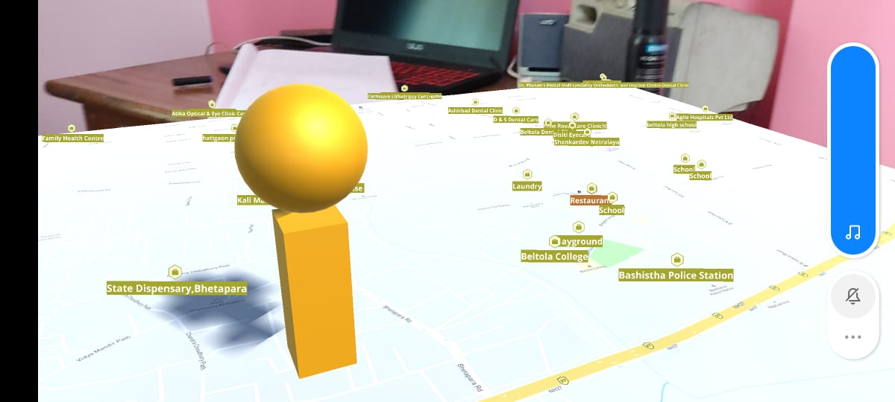

<html>
<body>
<h1 align="center"> AR-Map
</h1>  

<li>The .apk file for the AR build can be found in the github releases page related to the repository. </li>

<h2 align="left"> The Problem </h2>  
Opening maps, waiting for it to load and searching your location in a small screen of a mobile can be sometimes frustrating & pretty boring as well. Boring why? I mean it's not in AR ofcourse :)

<h2 align="left"> Solution </h2>  
This AR application provides a interesting solution to the problem. By using the power of MapBox SDK and AR Foundation, it can successfully show us a 3D map in augmented space with the precise location of the user. The user would know their exact location (no matter whichever part of the world they are from) and also get entertained by using a different kind of app rather than the same monotonous boring one.
Added functionalities such as:
<li>The app also provides 3D elevation to houses/buildings with polygons and also shows proper elevation in places like hills etc. </li>
<li>Added points of interests such as restaurants, services, transport facilities, etc on the map with suitable icons. </li>
<li>With v1.2, the user can also see a version of the map with satellite imagery which gives a more accurate description of the environment like hills, plains etc with ofcourse elevation. </li>

<h2 align="left"> Tech Stack </h2>  

Purpose | Tool
------- | -------
Base Software/Tool | Unity 2020.4 LTS
AR Integration | Unity Engine x AR Foundation x Google AR Core
Live Map Data/Location |  Mapbox SDK

<h2 align="left"> Working Demo v1.2</h2>
https://youtu.be/EmqoFddtWwY

<h2 align="left"> Working Demo v1.0</h2>
https://youtu.be/3y-jNCCXjVE

<h2 align="left"> Working Demo v0.7</h2>
https://youtu.be/D-DTVrKra5Y

</h1>  

<h2 align="left"> Instructions </h2>  
<li>Download and install the .apk file to run on an ARCore supported android device. </li>

</body>
</html>
